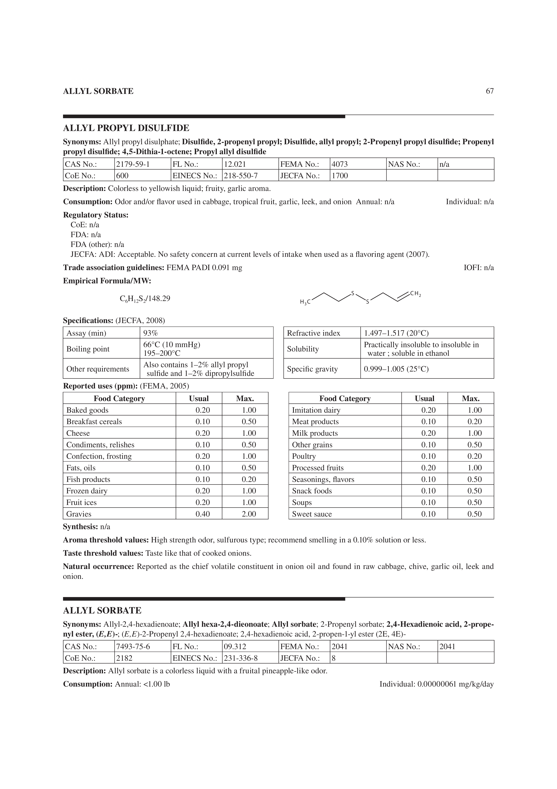

# Background

I was about to key in chunks of information into my excel spreadsheet at work this week. Usually, I will try to update my spreadsheet with the information that I read from books, journals, trade magazines so that I can easily retrieve the information about different flavor chemicals just by looking up their CAS number. I learnt this the hard way, because when I first started out on my job, I was giving out reports on flavor composition of different foods to colleagues who were not familiar with flavors. I was not much better as I only first started out on the job and the typing in of the chemicals was already very much a learning task for me to make sure that there are no typos. To allow everyone to know what each flavor chemical was, I went to copy and paste the description individually for the 50 or 60 plus flavor chemicals, each time, when I had to share the report. I spent so much more type copying and pasting then actually intepreting the report and familarising myself with the chemicals!

Finally I realised I should have an excel spreadsheet to store the information. My boss is very experienced in this field and already committed to memory all the different chemicals and their properties, but I was just starting out and had few bytes in my memory. 

I built and built my database, by manually typing what I come acorss, until I learnt that Flavorbase could be exported out in excel format, and I joined the databases together, until my colleagues in other locations sent me their database and I merged them together.

Now, I want to add the information from Fenaroli's handbook of flavor ingredients into my database. I was thinking if I should manually type the over 2000 pages of information? Or is there a better way?

A search on Google resulted in a relevation.... R has this package called tesseract for text mining! I used tabulizer before, there were some hits and misses and I often had to do a lot of cleaning before the data could be used. 

# Tesseract

I was looking at the vignette intro for the package and decided to try it out for myself. My text cleaning and string manipulation skills can be further improved, but I had a good first attempt at two of the pages!

# pdftools

However, I realised I had problem with extracting data stored in tables in the pdf file. This led me to the pdftools package. The problem with this package is that I cannot split the text into sections like what I did for Tesseract.

# Learning points:

- how to use tesseract to convert pdf to images, or straight away use images for text mining
- how to extract chemical name, cas number, fema number using pdftools

- merging the two tables with different information today


# Procedure

I followed the steps listed on: <https://cran.r-project.org/web/packages/tesseract/vignettes/intro.html>


## Load package

```{r}
library(tesseract)
library(pdftools)
library(tidyverse)
```


## Define file

I chose a page that had all the information printed on a single page. This is the ideal scenario, just for purposes of demonstrating that it will work for me.

```{r, include = FALSE}
setwd("~/Desktop/r-distill/myBlog/_posts/20211015 Text mining with tesseract")
```

## Convert pdf file to png file

A screenshot of the file is shown below.



Importing the file:

```{r}
compound_png <- pdftools::pdf_convert("test.pdf", dpi = 600) # this file should be saved in your computer

```

## Convert to text

Use optical character recognition on the png file.

Concatenate and print (cat) the file. 

```{r}
text <- tesseract::ocr(compound_png)

cat(text) # to see what was captured

```

## Text cleaning

- Chemical name: in uppercase letters, between DFE and Synonyms
- CAS number: this is tricky! Sometimes it is there, sometimes it is not
- Description - extract out
- Consumption
- Molecular weight and formula: hard to extract out
- Synthesis
- Aroma threshold values
- Taste threshold values
- Natural occurrence

### Text patterns - defined

```{r}
# caps
upper_case_pattern <- "\\b[A-Z]+\\b"  # CAPS

# caps before the word synonyms
caps_before_synon_pattern <-"\\b[A-Z]+\\b.+(?<=Synonyms)"


# define cas number pattern
cas <- "[[:digit:]]+-[[:digit:]]+-[[:digit:]]+"  # digits - digits - digits

# description: between description and consumption
description_pattern <- "(?<=Description: ).+(?= Consumption)"

# Consumption: between Consumption and Regulatory
consumption_pattern <- "(?<=Consumption: ).+(?= Regulatory)"


# Aroma: between values and Taste
aroma_pattern <- "(?<=values: ).+(?= Taste threshold)"

# Taste: between values and Natural
taste_pattern <- "(?<=Taste threshold values: ).+(?= Natural)"

```


```{r}
text_clean <-  text %>% 
  str_replace_all("\\n", " ") %>% 
  as_tibble() %>% 
  str_split_fixed(., " DFE ", 4) %>%  # split into sections by DFE
  as_tibble(.name_repair = "unique") %>% 
  pivot_longer(everything()) %>% 
  mutate(no_of_char = map_dbl(value, str_length)) %>% 
  filter(no_of_char > 50) %>%  # to set threshold to filter out irrelevant ones
  mutate(compound = str_extract_all(value, caps_before_synon_pattern,
                                    simplify = T),
         compound_clean = str_trim(str_replace_all(compound, "Synonyms", "")),
         description = str_extract_all(value, description_pattern,
                                       simplify = T),
         consumption = str_extract_all(value, consumption_pattern,
                                       simplify = T),
         aroma = str_extract_all(value, aroma_pattern,
                                 simplify = T),
         taste = str_extract_all(value, taste_pattern,
                                 simplify = T))
  
text_clean

```

# Using pdf tools

```{r}
library(pdftools)
library(naniar)

table_text <- pdf_text("test.pdf")
```

```{r, include = F}
cat(table_text)

str_view_all(table_text, caps_before_synon_pattern)
str_view_all(table_text, "(?=FEMA No.: ).+(?= NAS)") # Fema Number
str_view_all(table_text, "(?=CAS No.: ).+(?=FL No.)") # CAS NUMBER

compound_name <- "ALLYL SORBATE"
str_view_all(table_text, compound_name)

```


```{r}
# extract first one after compound name

table_pdf <- table_text %>% 
  str_split_fixed(., "\n\n\n", 4) %>% 
  as_tibble() %>% 
  pivot_longer(everything()) %>% 
  mutate(desc = str_squish(value)) %>% 
  mutate(no_of_char = map_dbl(value, str_length)) %>% 
  mutate(compound = str_extract_all(desc, caps_before_synon_pattern,
                                    simplify = T),
         compound_clean = str_trim(str_replace_all(compound, "Synonyms", ""))) %>% 
  select(-compound, value) %>% 
  mutate(cas = str_extract_all(desc, "(?=CAS No.: ).+(?=FL No.)",
                               simplify = T),
         cas_cleaned = str_trim(str_replace_all(cas, "CAS No.:", ""))) %>% 
  select(-cas) %>% 
  mutate(fema = str_extract_all(desc, "(?=FEMA No.: ).+(?= NAS)",
                                simplify = T),
         fema_cleaned = str_trim(str_replace_all(fema, 
                                                 "FEMA No.:", "" ))) %>%
  select(-fema) %>% 
  replace_with_na_at(.vars = c("cas_cleaned", "fema_cleaned"),
                     condition = ~.x == "") %>% 
  
  # remove entries without cas number
  filter(!is.na(cas_cleaned))

table_pdf
```

As I am unable to split the table_pdf by sections, I will only extract the compound name, CAS and FEMA from the table.

## Join two tables 

```{r}
table_pdf

text_clean

merged <- text_clean %>% 
  left_join(table_pdf, by = "compound_clean",
            suffix = c("_text", "_table")
            ) %>% 
  select(value_text, compound_clean, cas_cleaned, fema_cleaned, 
         description, consumption, aroma, taste) %>% 
  map_df(., str_squish)

glimpse(merged)
```

Allyl sorbate is an incomplete entry, so the text mining is not complete. 

However, this is a great start for me to start scraping!

My next step would be to try to scrape more pages and see how I can merge the data together.

# Appendix

Code chunk for trying out, before adding to the final cleaning step:

```{r}

# let me try on test text first
test_text <- text_clean %>% 
  filter(no_of_char > 1000) %>% 
  select(value) %>% 
  pull()

test_text

# To define different text patterns
str_extract_all(test_text,"(?<=Taste threshold values: ).+(?= Natural)")

```

```{r}
text_clean %>% 
  filter(compound_clean == "ALLYL SORBATE") %>% 
  select(value) %>% 
  pull()
```


# Reference:

- <https://cran.r-project.org/web/packages/tesseract/vignettes/intro.html>

- BURDOCK, G. A., & FENAROLI, G. (2005). Fenaroli's handbook of flavor ingredients. Boca Raton, Fla, CRC Press.