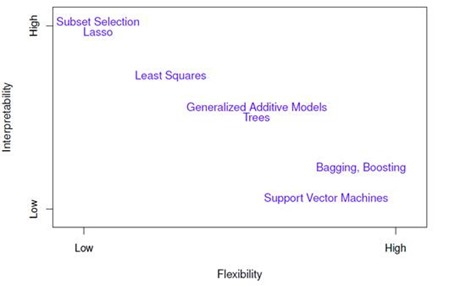

# Bias-Variance trade-off:

- High bias, low variance - Model is ineffective at modelling data and does not reflect the true relationship between predictors and outcome (high bias). However, model would not change substantially with new data points (low variance). 


- Low bias, high variance - Model can show the true relationship between predictors and outcome, is flexible (low bias), but any new data-points added may change the model significantly (high variance). 

# Over-fitting vs Under-fitting

- Overfitting: Building a model that is too complex for the amount of information available, and the model is fitted too closely to the pecularities of the data-set, and is unable to generalise to new data

- Under-fitting: When the model is too simple, and is unable to reflect the true relationship between predictors and outcomes. Model does poorly even for the training data-set. 

- A sign of overfitting for linear regression is that the training R^2/accuracy is very high, but the test R^2/accuracy is lower. 


```{r, fig.cap = " https://rkbookreviews.wordpress.com/2013/07/15/an-introduction-to-statistical-learning-review/", out.extra = "class=external", layout = "1-body-outset", echo=FALSE}

```


# Model selection vs Model Assessment

- Model selection: to select a proper level of flexibility for a model. A complex model may be used if it is a large dataset. 

- Model Assessment: to evaluate the model performance.

# Resampling

- 10-fold cross validation - if sample size is small, 10-fold CV may be carried out for model selection.

- Bootstrapping - if the sample size is small, bootstrapping may be carried out for model assessment (to assess model performance)

- If the sample size is large, and computational efficiency is prioritised, 10-fold CV is recommended.

# Reference:

- ISLR book <https://www.statlearning.com/>
- Applied Predictive Modelling book <http://appliedpredictivemodeling.com/>

This post is to remind myself about the things to take note of for transformation of variables for machine learning. Most of the text below is taken from the book: "Python Data Analysis". 